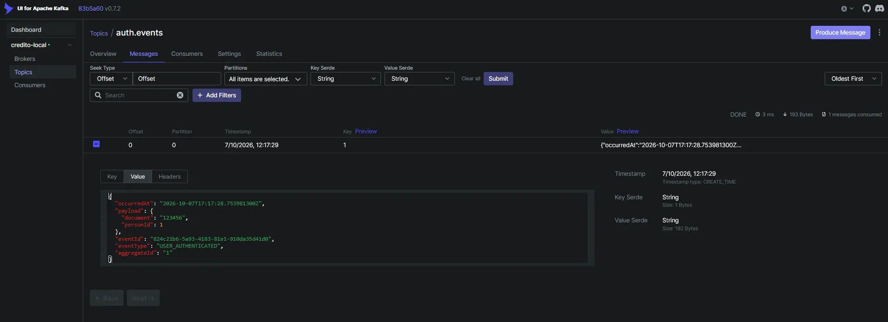
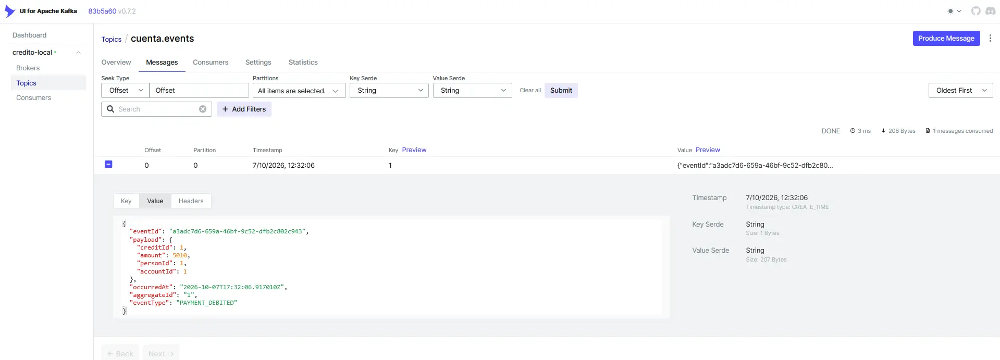

# Gestión de Crédito

Sistema de gestión de personas, cuentas y créditos construido con Spring Boot y Angular. La comunicación combina APIs REST, Eureka, Feign y eventos Kafka.



## Servicios

- `auth-service`: registro, login y tokens JWT.
- `persona-service`: gestión de personas.
- `cuenta-service`: cuentas, saldos y pagos.
- `credito-service`: créditos y cuotas.
- `discovery-server`: registro de servicios con Eureka.
- `gateway-service`: entrada común a las APIs.
- `frontend`: aplicación Angular.

## Tecnologías

- Java 25, Spring Boot 4.1.1 y Maven.
- Spring Cloud, Eureka, OpenFeign y Spring Security.
- PostgreSQL.
- Apache Kafka y Kafka UI.
- Angular.
## Requisitos

- Docker Desktop.
- Java 25.
- Maven.
- Node.js y npm para el frontend.

## Arranque local

Inicia PostgreSQL, Kafka y Kafka UI:

```bash
docker compose up -d
```

Después inicia los servicios Spring Boot y el frontend desde sus respectivas carpetas.
Servicios locales:

| Servicio | URL o puerto |
|---|---|
| Frontend | según la configuración de Angular |
| Gateway | `http://localhost:8090` |
| Persona | `http://localhost:8080` |
| Cuenta | `http://localhost:8081` |
| Crédito | `http://localhost:8082` |
| Auth | `http://localhost:8083` |
| Eureka | `http://localhost:8761` |
| Kafka | `localhost:9092` |
| Kafka UI | `http://localhost:8088` |

La configuración de PostgreSQL local es:

- Base de datos: `credito`
- Usuario: `postgres`
- Contraseña: `admin`
- Puerto: `5432`
## Eventos Kafka

Cada cambio de negocio publica un evento JSON con `eventId`, `eventType`, `aggregateId`, `occurredAt` y `payload`.

| Topic | Productor |
|---|---|
| `auth.events` | `auth-service` |
| `persona.events` | `persona-service` |
| `cuenta.events` | `cuenta-service` |
| `credito.events` | `credito-service` |

Los topics se crean automáticamente al utilizarse. Para consultar los mensajes, abre Kafka UI y entra en `credito-local` → `Topics`.

Consumidores incluidos:

- `cuenta-service` reacciona a `PERSON_DELETED`.
- `credito-service` reacciona a `ACCOUNT_DELETED`.
## Estructura

```text
auth-service/       Autenticación y usuarios
persona-service/    Personas
cuenta-service/     Cuentas y transacciones
credito-service/    Créditos y pagos
discovery-server/   Eureka
gateway-service/    API Gateway
frontend/           Aplicación Angular
```
